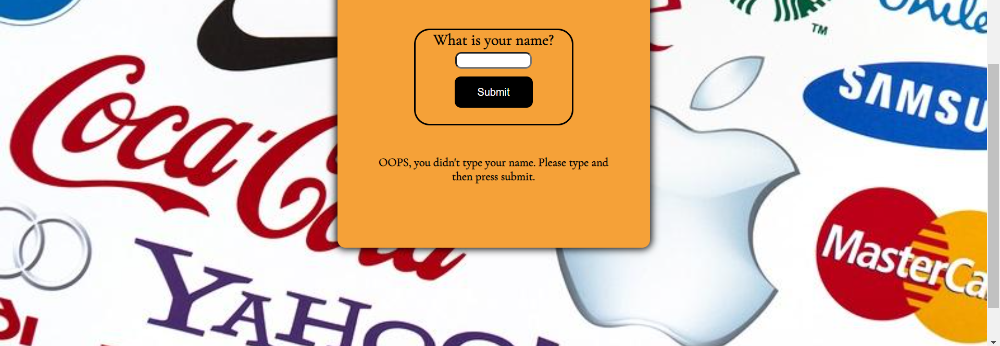

# THE JUJUBE FARM
This is a website for a trivia quiz about tech companies. The aim of this website to test the awareness  of the users knowledge of tech comapanies in a engaging way whilst making them aware of facts they might not have known before. This website consists of a landing page and container that contains 20 questions that apear in sucession ending with a score feedback. 


The deployed website can be viewed here. [TECH COMPANIES QUIZ](https://kaltun-dev.github.io/CI-Quiz-App/index.html).

## UX
### User Stories
+ As a user, I want to…
1.	be able to navigate the website easily.
2.	be able to what the quiz is about before playing
3.	be able to look the rules of the quiz and how to play.
4.	be able to know how many questions there will be.
5.  be able to know my score during and after playing the quiz.
6.  be offered various questions that can be easy as well as challenging.
+ As a site owner, I want…
1.	the quiz to be clear and informative.
2.	the total number of questions to be neigher too short that they become easy nor too lenghty to end up being challenging.
3.	the website to be simple to navigate.
4.  the user get a feedback on their total score. 

### 1. Strategy 
 * Project Purpose
    *    To provide the target user with informative and fun quiz questions .
    * 	 to keep users up to date with current facts in tech and tech comapnies.

### 2. Scope
 * I wanted a simple, straightforward UX experience.
 * I wanted a bright fun color scheme.
 * I wanted my content to be clear for all users. 
 * I wanted a site that is visually appealing on most devices.
 * I wanted a detailed information and rules about the quiz..

### 3. Structure
*	A clickable logo at the top of the page outlining what the website is about. 
*	A clear layout is in place to ensure users can immediately start the quiz.
*	The top part of the page is containing an introductory bio and a rules section..
*	The middle section has a form to input name and a submit button to submit their name.
*	A text prompting to enter their name if they didnt, for the quiz to start. .
*	At the bottom of the page is the footer section with clickable social media icons.

### 4. Skeleton
Wireframes created with Balsamiq. The project was developed from initial wireframes and more modifications were made during the development. 

Balsamic wireframe links for the website.

#### Large screen
* [Home page](https://github.com/kaltun-dev/jujube-farm/blob/main/assets/images/Screenshot-10.png) and [quiz Area](https://github.com/kaltun-dev/jujube-farm/blob/main/assets/images/Screenshot-11.png)


#### Small screen
* [Home page](https://github.com/kaltun-dev/jujube-farm/blob/main/assets/images/Screenshot-10.png) and [quiz area](https://github.com/kaltun-dev/jujube-farm/blob/main/assets/images/Screenshot-11.png)
 


### 5. Surface
* Colours

we have paid a lot of attention to the color scheme. And used 3 colors throught the website. we've chosen green to emphasise the feeling of nature and calmness. 


* Font Selection
 * Google font
we've used Cormorant Garamond for the main font, and Lora as a backup font for this website. Both fonts are from the Serif font family. This was done to enhance the formalness and the seriousness of the topic, since this quiz is about tech comapanies.
* The fonts are from [Google Fonts](https://fonts.google.com/).

## Existing Features 

+ Main home page consisting of four main sections.


1. A little bio section for the user that contains a brief four lines of text pertaining to the aim of the quiz.


2. A quiz rules button that leading to a pop up section that displays the rules of the quix, how to play, the total number of questuons and the score.


3. A form input for users name, once user submits name then the start button will apear, else if name is not submited then an alert text to enter name will apear bellow the form.


+ Quiz Area displaying the 20 questions one after the other


1. score displaying area at the top of the quiz. Which shows the number of pointes thus far. Each correct answer equals to one point out of 20 questions.


2. Question text area, which shows 20 questions one after the after the other in random order. Each time the page is refreshed questions are shown in a diferent order


3. Underneath the questions are four answer buttons and one next button. Once an answer is chosen, the correct answer button will turn green, and the all the incorrect answer buttons will turn red. This is helpful as it shows the user all the incorrect questions if they do the quiz again.
 

+ Score displaying area at the end of the game.

1.At the end of the quiz users will get a personalised text showing their score and preif words of encouragement. Aditionaly there is a restart button, which takes users to the start home page and resets all, name, score and questions.

 
+ Footer area
1. Very simple footer section at the bottom of the page which contains 3 social media links. One for twitter, one for linkedin and one for github.


# Testing

## Automated tests

  + HTML

 This website passed the w3c html validation. There were several errors but they have all been fixed. [W3C validator](https://validator.w3.org/).

  Validation results:
  

  + CSS

 During the testing, one error and one warning was found and corrected and thus passing through the official wc css validation  [W3C validator](https://jigsaw.w3.org/css-validator/). 

 validation results
 

 + JavaScript
 Jshint was used for the javascript validation. There were over 40 warnings but eventually everything was corrected and website passed through the jshint validation. [Jshhint validator](https://jshint.com/)
 

## Manual Testing

   + Desktop

 Everything is working good Mozilla Firefox, Google Chrome, labtop and large tablet screen . Page loads and all of the page features are working.

   + Mobile
 
 Tested with Samsung s21, Samsung s22, Galaxy tab s8 ultra, and iPhone XR. It is responsive as intended.

   +  chrome dev tools lighthouse


As it's shown on the image, the the accessibilty score is 90/100. This is due the form on the page. IF form id is removed then form wont connect the javascript functions and hence this issue coudnt be fixed.  .

+ Mozila dev tools.
Testing on all devices on mozila is good too. 

## Future Features
1. I would like to add different levels to the quiz.
2. I would also like to add a current question out of the total questions counter on top of the quiz.
3. I would also like to add different questions from all topics.
4. I would also like to add a feature where a group of questions can play against each other. 
5. i would like to add images and sounds to some of the questions so that it can be engaging for types of players.
6. I would like to be able to give users the option to select the langauge they prefer so that anyone can play no matter what language they speak.

## Project Bugs and Solutions:
No known bugs now. But there were quite few problems at every stage. Whenever i fixed a problem there was an another. Here are some.

problems and bugs
problem one 
array sytax was wrong and it was returning 250 errors 
fix: fixed array sysntax problem, it was missing = operator at the begining"


problem 2
questions werent showing on the questions container.

solution, 
iwas using getelmentbyid eventhough i didnt use id selctor but a class selector.


problem 2 

answerbuttons and overflowing the center div container.

solution
styled new buttons, made body wider vh, increased container width and height and styled bottons with with flex column direction

problem 3
score wasnt showing
score wasnt displaying correct score


problem 3 
input button was still displaying after re-start


 10. Some other problems
H4 bio heading is not styling css
Assets folder file paths error due to renaming the folder.
Hero image sizing was not good quality.
Git pushing error due to system problemss.


## Deployment

 The website was deployed to GitHub pages. 
 
 * The steps to deploy are as follows: 
  - In the GitHub repository, navigate to the Settings tab; 
  - From the source section drop-down menu, select the Master Branch;
  - Once the master branch has been selected, the page will be automatically refreshed with a detailed ribbon display to indicate the successful deployment. 
The live link can be found [here](https://kaltun-dev.github.io/jujube-farm/index.html).

### Forking the GitHub Repository:

By forking the GitHub Repository you will be able to make a copy of the original repository on your own GitHub account allowing you to view and/or make changes without affecting the original repository by using the following steps:
1. Log in to GitHub and locate the [GitHub Repository](https://github.com/kaltun-dev/jujube-farm)
2. At the top of the Repository (not top of page) just above the "Settings" Button on the menu, locate the "Fork" Button.
3. You should now have a copy of the original repository in your GitHub account.

### Making a Local Clone

1. Log in to GitHub and locate the [GitHub Repository](https://github.com/kaltun-dev/jujube-farm)
2. Under the repository name, click "Clone or download".
3. To clone the repository using HTTPS, under "Clone with HTTPS", copy the link.
4. Open Git Bash
5. Change the current working directory to the location where you want the cloned directory to be made.
6. Type `git clone`, and then paste the URL you copied in Step 3.
```
$ git clone https://github.com/kaltun-dev/jujube-farm
```
7. Press Enter. Your local clone will be created.

## Credits 

### Content

All content was written using sources and background information from: 

- 
-
-

### Media

- All pictures and images used in this project are from [CANVA](https://www.canva.com/) 

### Work based in other code

+ [W3 Schools](https://www.w3schools.com/) - used daily for variety of problems and for deeper understanding of both HTML and CSS concepts.
+ [kevin powels Youtube channel](https://www.youtube.com/watch?v=u044iM9xsWU&list=LL&index=4&t=1157s) - Amazing flex-box tutorial, used it to understand flexbox..
+ [mohamed haroon Youtube channel](https://www.youtube.com/watch?v=qPvekXHaESc&list=LL&index=2) - Used for hero image using flexbox..
+ ["Love Running" footer code](https://learn.codeinstitute.net/courses/course-v1:CodeInstitute+LR101+2021_T1/courseware/4a07c57382724cfda5834497317f24d5/12ba169db7b34b82b137edd825af6a02/) - Used for the footer and why choose us section. 
+ ["easy toturials youtube channel](https://www.youtube.com/watch?v=oYRda7UtuhA&list=LL&index=6&t=415s) used for our-farm and our- produce section using flexbox.


### Acknowledgements

-	To the Code Institute for the course material, lectures and their grounded guidlines for the project.  

-	To the Slack community for being so helpful despite asking 3 or more questions everyday. Thank you for the dozens of informative groups.  

- To [W3schools](https://www.w3schools.com/)  for general reference regarding sytax, tags, elements and everything in between.


